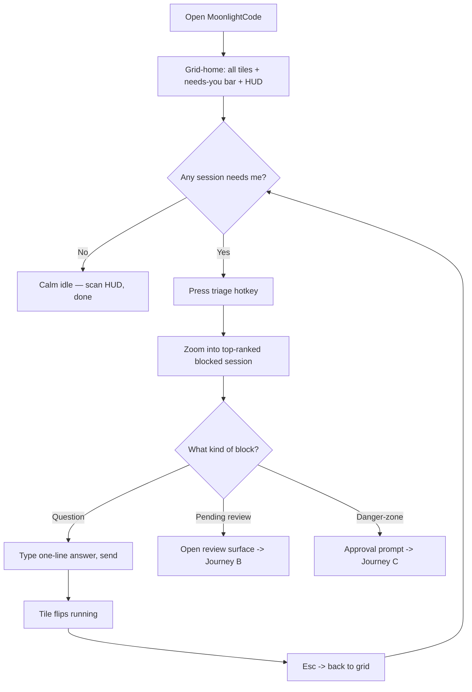
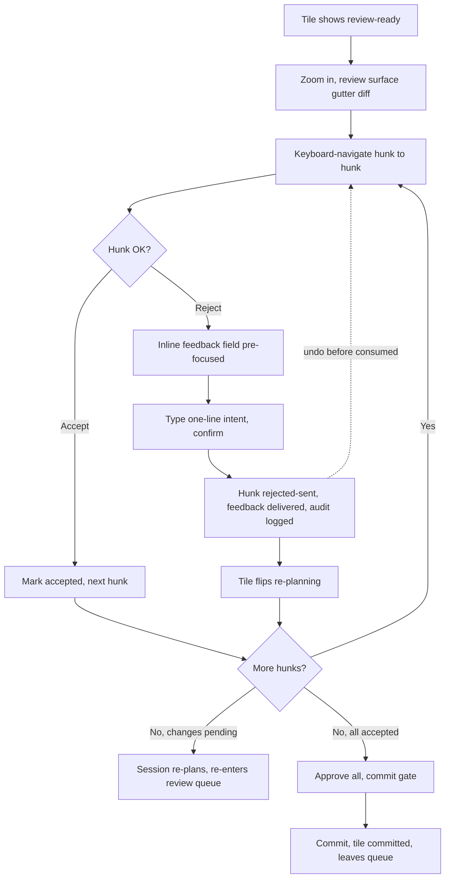
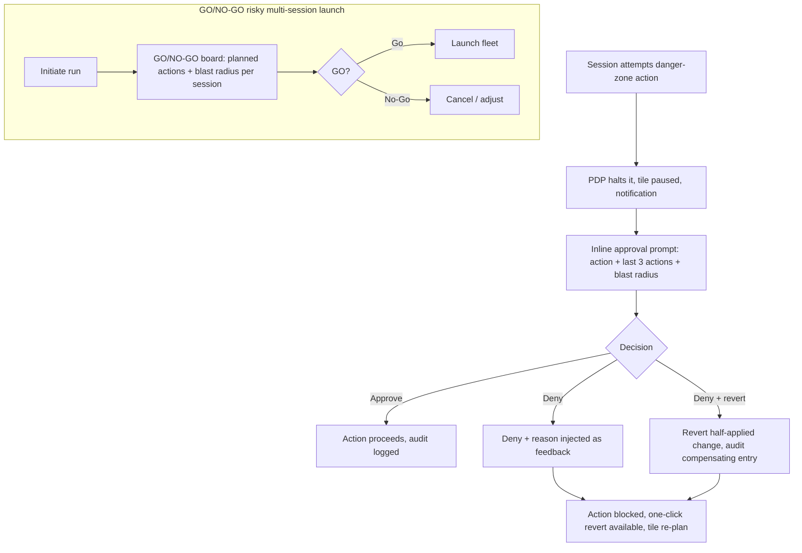
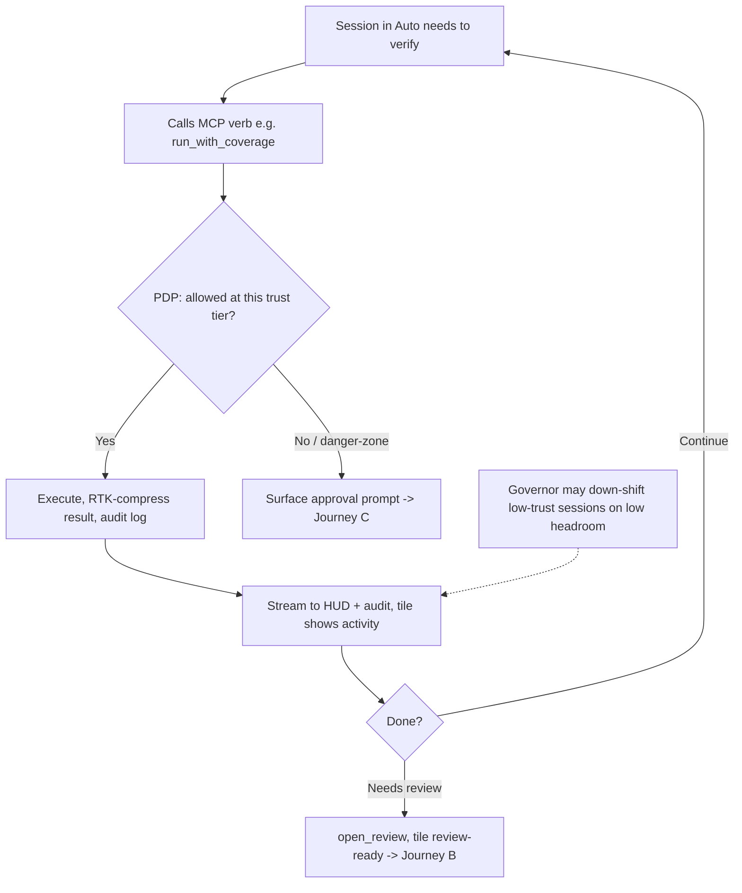

# UX Design Specification MoonlightCode

**Author:** Titouan
**Date:** 2026-06-02

---

<!-- UX design content will be appended sequentially through collaborative workflow steps -->

## Executive Summary

### Project Vision
MoonlightCode is a calm, AI-centric **cockpit** for directing many Claude Code sessions at once. The UX inverts the IDE: instead of a code editor at center, **live Claude sessions are the focal surface**, framed by dockable panels (grid, needs-you queue, review, HUD). The experience must make a fleet of autonomous agents feel *supervisable and steerable* by one person — never overwhelming.

### Target Users
A single power user (Titouan) who runs Claude Code all day, rarely hand-codes, and orchestrates several parallel sessions. Tech expertise: very high. Device: macOS desktop, large screen, keyboard-driven. Context of use: long, focused work sessions with frequent attention-switching between agents. The "aha": never hunting for which session needs you, and steering an agent with a gesture (reject a hunk → it self-corrects).

### Key Design Challenges
1. **Attention without overwhelm.** N parallel sessions each emit activity; the UI must triage *for* the user (needs-you queue, traffic-light tiles) and stay calm-by-default — surface things only when they matter.
2. **Conveying agent state at a glance.** Status (running/waiting/done/errored) and phase (Plan→Auto→Test→Review→Commit) must read instantly, accessibly (badge **+** color, never color alone), across many small tiles.
3. **Trust & safety legibility.** Autonomy under trust tiers + danger-zone approvals + audit must be *visible and reversible* — the user has to feel in command, approve fast, and undo with confidence.
4. **The center-pane inversion.** Making session terminals the center (not code) while keeping JetBrains-grade dockability is an unusual layout users must grok immediately.
5. **Keyboard-first in a dense UI.** A command palette + hotkeys must drive everything (triage, toggle Auto↔Plan, accept/reject) so hands stay on the keyboard.

### Design Opportunities
1. **Rejection-as-feedback as a signature interaction** — make the reject→steer loop feel tactile and rewarding (the moment that defines the product).
2. **The needs-you queue as home base** — a single prioritized "what needs me now" surface that makes triage a sub-10-second ritual.
3. **An OMC-style ambient HUD** — glanceable token/context/rate-limit health that informs without nagging (calm telemetry).
4. **Phase-aware visual language** — the tile's appearance *teaches* the workflow state machine just by looking at it.
5. **Focus mode ↔ grid fluidity** — effortless zoom between "the whole fleet" and "one session, full attention."

## Core User Experience

### Defining Experience
The product's core loop is **Triage → Inspect → Steer**, repeated all day across the fleet:
1. **Triage** — glance at the needs-you queue / grid, see instantly which session is blocked, done, or errored.
2. **Inspect** — jump into that session (focus mode), read the diff or the question.
3. **Steer** — approve, reject-with-feedback, toggle Auto↔Plan, or type a redirection — then back to the fleet.

If this loop is sub-10-seconds and keyboard-driven, the whole product works. Everything else (HUD, autonomy, persistence) serves this loop.

### Platform Strategy
- **macOS desktop, single-build native (GPUI).** Large-screen, mouse+keyboard, **keyboard-first**. No touch, no mobile, no web.
- **Offline-capable** for everything local (grid, review, HUD, history); only agent execution needs network — network stalls shown distinctly from "needs you."
- Leverages native OS: notifications (with DND/focus batching), keychain, multiple displays, window/space management.

### Effortless Interactions (must require zero thought)
- **"Take me to who needs me"** — one key jumps to the top of the needs-you queue, lands in that session focused and ready for input.
- **Reject-as-feedback** — select a hunk, hit reject, type one line; it's delivered to the agent as steering. No copy-paste, no context-switch.
- **Auto↔Plan toggle** — a single key flips the active session's mode; the tile reflects it immediately.
- **Approve/deny** danger-zone prompts inline, from the keyboard, with the reason auto-attached on deny.
- **Calm idleness** — when nothing needs you, the UI is quiet; no badges scream, no panels fight for attention.

### Critical Success Moments
- **First triage win:** the morning you open MoonlightCode and clear "who needs me" in seconds instead of hunting tabs — *"I'm in control, not catching up."*
- **First closed loop:** you reject a hunk, watch the session re-plan from your feedback — *"I steered it with a gesture."*
- **First safe save:** a session tries something dangerous, MoonlightCode halts it, you deny + revert in two keystrokes — *"nothing bad happens without me."*
- **Make-or-break failure to avoid:** a *missed* blocker (a session silently waiting) — the single worst UX outcome; the design must over-surface blockers rather than under-surface.

### Experience Principles
1. **Calm by default, loud only when it matters.** Silence is the baseline; signal is earned.
2. **Triage in a glance, act in a keystroke.** Status legible instantly; every core action keyboard-reachable.
3. **Never lose a blocker.** Bias toward surfacing; a false nudge beats a missed wait.
4. **Steering over typing.** Gestures (reject, toggle, approve) carry intent; prose is the fallback, not the default.
5. **Command is visible and reversible.** Autonomy is always observable, gated, and undoable — the human feels in charge.
6. **The fleet and the one.** Fluidly zoom between whole-fleet awareness and single-session focus.

## Desired Emotional Response

### Primary Emotional Goals
The dominant feeling is **calm command** — the quiet confidence of a pilot scanning instruments, not a juggler dropping balls. You should feel **on top of the fleet**, never chased by it. The signature emotion that would make you evangelize it: *"I direct a team of agents and nothing slips."*

### Emotional Journey Mapping
- **First run:** *curiosity → relief* — "finally, one place that shows me everything" (not overwhelm).
- **Daily open / morning triage:** *grounded control* — "I see exactly what needs me," replacing the old low-grade dread of "what did I miss overnight?"
- **Core loop (steer):** *agency and flow* — rejecting a hunk and watching the agent correct feels like a satisfying, low-friction gesture.
- **When something goes wrong (session errors / danger-zone):** *protected, not panicked* — the tool caught it, you decide, you can undo. Composure, not alarm.
- **Returning after a break:** *instant re-orientation* — "what was I doing" summaries mean zero cold-start anxiety.
- **Idle / nothing pending:** *peace* — the UI is quiet and you trust that silence (no nagging).

### Micro-Emotions
Most critical for success:
- **Trust > skepticism** — you must believe the "needs you" signal and the safety gates completely (a single missed blocker or false-safe erodes this fast).
- **Confidence > confusion** — state is always legible; you never wonder "what is this session doing?"
- **Accomplishment > frustration** — steering lands cleanly; the loop closes.
- **Calm > anxiety** — density never tips into noise.

### Design Implications
- **Calm command →** muted resting palette, generous whitespace, motion only on genuine state changes; the HUD informs peripherally, never flashes.
- **Trust →** over-surface blockers (false nudge > missed wait); make every autonomous action visible in the audit + one-click undo; safety gates unmissable but not aggressive.
- **Agency/flow →** the reject→feedback and Auto↔Plan gestures are instant, keyboard-driven, with immediate visible response on the tile.
- **Protected-not-panicked →** error/danger states use a firm-but-composed visual register (clear, bordered, actionable) — not red-alert spam.
- **Peace in idleness →** strict calm-by-default; resolved items fade, nothing lingers demanding acknowledgment beyond what's real.

### Emotional Design Principles
1. **Quiet competence over flashy delight** — an instrument panel, not a toy; restraint *is* the delight.
2. **Earn trust every interaction** — signal accuracy and action reversibility are emotional features, not just functional ones.
3. **No false alarms, no missed alarms** — both destroy calm; precision of attention is the emotional core.
4. **Composure under failure** — the worse the situation, the calmer and clearer the UI gets.
5. **Reward the gesture** — every steer produces immediate, legible feedback so agency feels real.

## UX Pattern Analysis & Inspiration

### Inspiring Products Analysis
- **JetBrains IDEs (IntelliJ).** Gold standard for **dockable/splittable panels**, the **gutter-marked diff/review** view, and **run/debug config** UX. Crucially, JetBrains is **calm-by-default**: most tool windows are collapsed to the edge rails and summoned on demand — typically only the project/code explorer shows at rest. So MoonlightCode's calm-by-default model *follows* JetBrains, not departs from it. Strength: dense power made navigable via reveal-on-demand. Watch-out: avoid the over-stuffed look that comes from pinning everything open.
- **CodeIsland.** The current session-state monitor — proves the *value* of at-a-glance session status but stops at *observing*. Lesson: keep its glanceability, add the *acting*.
- **oh-my-claudecode HUD / status bar.** The model for **calm ambient telemetry** — context %, tokens, model, git, mode in a compact always-on strip. Lesson: peripheral, configurable, never demands focus.
- **Zed.** Same GPUI lineage — sets the bar for **native speed, restraint, keyboard-first** flow; its command palette and minimal chrome. Lesson: fast and quiet beats feature-flashy.
- **Air-traffic / mission-control (orthogonal).** Inspiration for **triage under load** — prioritized queues, status legibility across many objects, GO/NO-GO gating. (Note: the user dislikes the *Grafana look* — take the *concept* of live gauges, not the dashboard aesthetic.)

### Transferable UX Patterns
**Navigation / layout:**
- JetBrains **edge-rail tool windows** (collapsed by default, summon/pin/dismiss) → the dockable panels around the center session pane; calm at rest, revealed on demand.
- **Command palette** (Zed/JetBrains ⌘-Shift-P) → keyboard-first entry to every action.
- **Focus ↔ grid** zoom (mission-control style) → fleet overview vs. single-session.

**Interaction:**
- **Gutter diff + per-hunk actions** (JetBrains) → the review surface; extend with reject→feedback.
- **Prioritized inbox/queue** (triage tools) → the needs-you queue as home base.
- **Inline approval prompts** → danger-zone / GO-NO-GO gates answered from the keyboard.

**Visual:**
- **Ambient status strip** (OMC) → the HUD; calm, configurable, peripheral.
- **Status as badge + color + border** (CodeIsland-grade glanceability, accessibility-hardened) → traffic-light tiles.

### Anti-Patterns to Avoid
- **Grafana/dashboard sprawl** — walls of charts and gauges; conflicts with calm-command (per user preference).
- **Always-on red badges / notification spam** — destroys the "trust the silence" goal.
- **Color-only status** — fails accessibility and glanceability under fatigue; always pair badge + color.
- **Modal-heavy flows** — blocking dialogs for every approval break keyboard flow; prefer inline, dismissible, keyboard-answerable prompts.
- **Chat-as-only-interface** — forcing prose for everything; gestures first, prose as fallback.
- **Everything pinned open** — the over-dense default; start calm, reveal on demand (the JetBrains way).

### Design Inspiration Strategy
**Adopt:** JetBrains edge-rail docking + reveal-on-demand + gutter-diff review; OMC ambient HUD; Zed-grade command palette + native speed + restraint; CodeIsland glanceable session status.
**Adapt:** mission-control triage/GO-NO-GO concepts (without the chart-heavy aesthetic); the center pane is *sessions*, not code; status uses badge+color+tile-border, not just a dot.
**Avoid:** dashboard sprawl, alarm spam, color-only signaling, modal overload, chat-only interaction, everything-pinned-open.

This keeps MoonlightCode unmistakably an *IDE you trust* (JetBrains DNA) that's *calm and fast* (Zed/OMC) and *built for steering agents* (the new part nobody else has).

## Design System Foundation

### Design System Choice
**gpui-component (longbridge) as the component foundation + a thin MoonlightCode design-token layer + custom signature components.** On GPUI there is no Material/MUI-style web design system; the realistic foundation is the mature `gpui-component` library (60+ native-feeling desktop components, built-in `Theme`/`ThemeColor`, virtualized Table/List, high-performance code editor with LSP — macOS/Windows + shadcn/ui inspired).

Three layers:
1. **Foundation — `gpui-component`:** heavy/standard widgets — Table & List (virtualized → session grid, needs-you queue, audit log), code editor / text view (→ diff & review surface, terminal-adjacent inspection), inputs, buttons, panels/docking primitives, theming engine.
2. **Token layer — MoonlightCode design tokens:** a thin semantic layer over `gpui-component`'s `ThemeColor` defining the calm palette, dark/light themes, the **accent that drives the traffic-light status palette**, spacing/density scales, and typography. All components read tokens — no hardcoded colors (mirrors the architecture's "no stringly-typed/no hardcoded" discipline).
3. **Signature components — custom:** the few pieces where distinctiveness matters and where the product's identity lives:
   - **Session tile** (status badge + traffic-light name/border + phase indicator + mini-HUD).
   - **HUD strip** (OMC-style ambient telemetry).
   - **Review surface** (gutter diff + per-hunk accept/reject → feedback), built on the library's code-editor component but with custom hunk-action affordances.
   - **Needs-you queue** item + **approval/GO-NO-GO** prompt.

### Rationale for Selection
- **Solo-builder velocity:** tables, lists, code editor, theming out of the box — the highest-effort widgets are not hand-built.
- **Native macOS feel + theming:** matches the calm-command aesthetic and the dark/light + accent requirement (NFR20, brainstorm theming).
- **Distinctive where it counts:** custom signature components carry the identity (tile, HUD, review) without rebuilding commodity widgets.
- **Architecture-consistent:** the token layer enforces "no hardcoded colors / badge+color, never color-only," and components stay swappable.

### Implementation Approach
- Add `gpui-component` as a workspace dependency (pinned, tracking the same GPUI revision as the shell — see risk).
- Define the **design-token module** in `apps/desktop` (e.g. `views/theme.rs`) wrapping `gpui-component`'s `Theme`/`ThemeColor`; expose semantic tokens (`status.running`, `status.waiting`, `phase.plan`, `surface.calm`, `accent`, …).
- Build signature components as `RenderOnce` GPUI components consuming only tokens.
- Light/dark themes + a single configurable **accent** that recolors the traffic-light palette consistently.

### Customization Strategy
- **Adopt unchanged:** Table, List, inputs, code editor internals, docking/panel primitives.
- **Restyle via tokens:** all surfaces, borders, typography → calm palette.
- **Fully custom:** session tile, HUD strip, traffic-light status system, review hunk-actions, approval prompts, command palette styling.
- **Risk & mitigation:** `gpui-component` (like GPUI) is pre-1.0 — pin to a known-good revision aligned with the shell's GPUI version; the token layer + signature components isolate us from upstream restyles; the architecture's egui fallback remains the nuclear option if GPUI itself proves untenable.

## 2. Core User Experience

### 2.1 Defining Experience
**"Jump to whoever needs me, and steer them with a single gesture — then back to the fleet."**

The interaction you'd describe to a friend: *"A session finishes, I glance at the diff, reject the one part I don't like with a one-line note, and the agent re-plans from my feedback — I never touched a terminal or wrote a paragraph."* The defining moment is **reject-as-feedback**: an approval gesture that doubles as steering.

### 2.2 User Mental Model
- The user thinks like a **team lead reviewing PRs**, not a coder editing files. Mental model = "approve / request changes," already familiar from GitHub/JetBrains.
- Today's workaround: alt-tab to the right terminal, scroll, type a corrective paragraph, hope it lands. Friction = finding the session + composing prose + losing your place in the fleet.
- Expectation carried in: a **review queue** (GitHub) + **keyboard-driven navigation** (JetBrains/Zed). MoonlightCode meets that model, then collapses "request changes" and "tell it what to do" into one act.
- Confusion to preempt: "did my rejection actually reach the agent?" → must give unmistakable confirmation that feedback was injected.

### 2.3 Success Criteria
- **Sub-10-second loop:** notification/queue → focused session → decision → back to fleet.
- **Zero context-switch:** never leave MoonlightCode, never alt-tab to a terminal, never copy-paste.
- **Unmistakable confirmation:** the moment you reject, you *see* the feedback was delivered and the session move (status flips to working/re-planning).
- **Keyboard-only capable:** the entire loop doable without the mouse.
- **It feels like a gesture, not a form:** one keystroke to reject, one short line of intent, done.

### 2.4 Novel UX Patterns
**Familiar patterns recombined, plus one novel twist.**
- *Established (adopt as-is):* review queue, per-hunk accept/reject (GitHub/JetBrains), command palette, prioritized inbox. No user education needed.
- *Novel twist:* **rejection emits structured feedback to an autonomous agent that acts on it.** "Request changes" isn't a passive comment for a human to read later — it's a live steering signal. Teaching: lean on the familiar review metaphor, then make the agent's *immediate reaction* the teacher (reject → tile flips to "working" → re-plan appears). Behavior demonstrates the novelty; no tutorial needed.

### 2.5 Experience Mechanics

**1. Initiation**
- A session reaches "done" → **auto-reverts to Plan**, tile turns blue with a "✓ review" badge, and (if you're away) an OS notification fires.
- You press the **triage hotkey** ("take me to who needs me") → MoonlightCode focuses that session and opens the **review surface** (gutter diff) — the queue ordered the choice for you.

**2. Interaction**
- You read the diff (gutter markers, "since I last looked" scoping). Keyboard-navigate hunk to hunk.
- On a hunk you dislike: press **reject**. An inline, single-line feedback field appears (pre-focused). You type one line of intent ("exponential backoff, cap 3 retries") and confirm. (Empty = reject without note still allowed.)
- Accept hunks pass silently; commit stays gated behind your explicit final approval.

**3. Feedback**
- The instant you confirm: the hunk visibly marks **rejected→sent**, a brief inline confirmation ("feedback delivered") appears, and the **session tile flips to 🟡/working** as it re-plans. This closes the "did it land?" gap.
- The injected feedback is also recorded in the session's audit/timeline (traceability), so you can see exactly what you told it.
- Mistake recovery: an **undo** on a just-sent rejection (before the agent consumes it); the action is in the audit log either way.

**4. Completion**
- When the session re-plans and produces a revised diff, it re-enters the review queue (status → blue again) — the loop is *visibly* closed.
- Once satisfied, **approve all → commit gate → commit**. Tile goes to "done/committed," fades from the needs-you queue.
- You return to the grid; the queue surfaces the next session needing you. Calm restored.

## Visual Design Foundation

### Color System
**Dark-first, calm neutral base + teal/cyan accent + a status-only chromatic layer.** No prior brand (personal tool); palette tuned to "calm command."

**Base (dark theme, default):**
- `surface.base` #15161B (app background) · `surface.raised` #1C1E26 (panels/tiles) · `surface.overlay` #23262F (popovers, palette)
- `border.subtle` #2A2D38 · `border.strong` #3A3E4B
- `text.primary` #E6E8EF · `text.secondary` #A0A4B2 · `text.muted` #6B7080

**Accent (identity, interactive):** `accent` #2DB7B0 (teal) · `accent.hover` #34CFC6 · `accent.muted` #1E6F6B. Used for selection, focus rings, primary actions, the "done" status, and HUD highlights.

**Status palette (the traffic-light system) — resolved to stay distinct from the teal accent:**
| Status | Color | Badge | Border treatment |
|---|---|---|---|
| Running | `status.running` #36A35E (saturated forest-green, pushed away from teal) | ● | thin solid |
| Waiting-input (needs you) | `status.waiting` #E0A83E (amber) | ◐ | **pulsing/thicker** border to draw the eye |
| Done (review) | `status.done` #2DB7B0 (teal = accent) | ✓ | solid, accent-tinted |
| Errored | `status.error` #E5534B (red) | ✕ | solid, slightly heavier |
| Idle/paused | `status.idle` #6B7080 (neutral gray) | ○ | dim border |

> **Anti-color-only rule (NFR20):** status is *always* badge **+** color **+** border treatment. The forest-green/teal pair is differentiated by badge shape (● vs ✓) and border, so running vs done remains legible under color-vision deficiency or fatigue. Verified target: distinguishable in grayscale by badge + border alone.

**Light theme:** a mirror token set (raised surfaces lighten, text inverts, same accent + status hues at adjusted lightness for contrast). Single configurable accent variable lets the palette retheme without touching components.

### Typography System
- **Tone:** technical, precise, quiet — an instrument panel.
- **UI typeface:** the platform UI font (SF Pro on macOS) via gpui-component defaults, for native feel and zero bundling.
- **Monospace:** a developer mono (e.g. SF Mono / JetBrains Mono) for terminals, diffs, code inspection, session IDs, token counts.
- **Type scale (compact, dense-but-legible):** `h1` 18 · `h2` 15 · `h3` 13 (semibold) · `body` 13 · `label` 12 · `caption/HUD` 11 · `mono` 12–13. Line-height 1.4 body / 1.25 dense lists. Numeric/HUD values tabular-figures for stable alignment.
- **Hierarchy by weight + color, not size inflation** (keeps density calm): secondary text uses `text.secondary`, not smaller-and-smaller sizes.

### Spacing & Layout Foundation
- **Base unit: 4px**, scale `{2,4,8,12,16,24,32}`. Dense by default (this is a control surface), but tiles/cards get internal 8–12px breathing room so density never reads as cramped.
- **Layout:** JetBrains-style edge-rail docking — collapsed by default, summoned on demand (calm-by-default). Center pane = session terminals; rails host grid, needs-you queue, review, HUD, file tree, inspection.
- **Tiles:** responsive grid; resizable; focus mode collapses to one full-bleed session. Consistent 8px gutter between tiles.
- **HUD:** a thin (≈24px) ambient strip; tabular figures; never reflows during updates (NFR4 — no UI jank).
- **Motion:** minimal and meaningful — transitions only on genuine state changes (status flip, panel summon, feedback-sent confirmation). No idle/ambient animation. Respect reduced-motion.

### Accessibility Considerations
- **Never color-only:** badge + color + border for every status (above).
- **Contrast:** text and status targets meet WCAG AA (≥4.5:1 body, ≥3:1 large/UI) against their surfaces; verify the amber/green/teal trio against `surface.raised`.
- **Keyboard-first:** every action reachable without mouse (NFR19); visible focus ring (accent) on all interactive elements.
- **Reduced-motion** honored; **dark/light** both first-class.
- *(Personal tool — no formal WCAG audit target, but these are cheap, fatigue-reducing defaults worth keeping.)*

## Design Direction Decision

### Design Directions Explored
The visual language was already converged (calm command, dark-first, teal accent, JetBrains edge-rail docking), so exploration focused on the **cockpit layout arrangement** — the decision that shapes the whole experience. Three directions were considered:
- **Focus-first:** center = one active session; grid/queue in collapsible rails.
- **Grid-home (mission control):** center = the session grid (whole fleet visible); zoom into a tile to deep-work.
- **Queue-left split:** persistent left needs-you rail + center session + right review.

### Chosen Direction: Grid-home (Mission Control)
The **default/home view is the session grid** — all sessions visible as tiles at once, fleet-wide awareness by default. A **needs-you bar across the top** ranks blocked sessions; the **HUD strip sits at the bottom**. Clicking/focusing a tile (or the triage hotkey) **zooms into that session** (terminal + review surface); Escape returns to the grid.

```
┌─ needs-you: ◐ auth-refactor · ◐ search-idx ─────────────┐  ← ranked blocked bar (top)
├──────────────────────────────────────────────────────────┤
│  ┌──────┐ ┌──────┐ ┌──────┐ ┌──────┐                       │
│  │● api │ │◐ auth│ │✓ pay │ │● idx │   ← session tiles      │
│  │Auto  │ │Plan  │ │review│ │Auto  │     (badge+color+      │
│  └──────┘ └──────┘ └──────┘ └──────┘      border+phase)     │
│  ┌──────┐ ┌──────┐                                          │
│  │✕ ui  │ │○ docs│        click/⏎ a tile → zoom to session  │
│  └──────┘ └──────┘                                          │
├─ HUD: ctx 42% · ₩15k · opus · saved 38% ──────────────────┘  ← ambient strip (bottom)
```

**Zoomed (single-session) view** keeps the needs-you bar + HUD, swaps the grid for the focused session's terminal (center) + review surface (right rail, summoned when a diff is pending); Esc → back to grid. Edge rails (file tree, inspection, non-Claude terminal) remain summon-on-demand per the JetBrains calm-by-default model.

### Design Rationale
- **Matches the #1 success metric** ("never miss a blocker") — the whole fleet + ranked needs-you bar are *always* on screen; nothing hides.
- **Fits "calm command"** — a mission-control board is the literal metaphor for supervising many agents; the grid *is* the instrument panel.
- **Supports the core loop** — triage happens at the grid level (glance → ranked bar → zoom), steering happens in the zoomed view, return is one Esc. The fleet↔one zoom is the primary navigation.
- **Trade-off accepted:** deep single-session work takes one extra action (zoom in) vs. focus-first — acceptable because this is an *orchestration* tool first, an editor second; fleet awareness outranks single-session immersion.

### Implementation Approach
- Built on `gpui-component` virtualized grid/list (handles many tiles); **session tile** is a custom signature component (badge + traffic-light name/border + phase chip + mini-HUD).
- Grid ↔ zoom is a view-state transition in `apps/desktop/views/workspace.rs` (animated, reduced-motion aware); needs-you bar and HUD are persistent across both states.
- An optional **HTML visual mockup** of the grid-home screen can be generated on request as a look-and-feel preview (the canonical spec is this doc; the app itself is native GPUI, so no web mockup is load-bearing).

## User Journey Flows

### Journey A — Morning Triage (Orchestrator)
Entry: open app (or return from away) → grid-home with ranked needs-you bar.



### Journey B — Reject-as-Feedback (Reviewer, the defining loop)
Entry: a session is `done` → auto-reverts to Plan, tile shows "✓ review".



### Journey C — Danger-Zone / GO-NO-GO (Safety)
Entry: a session attempts a danger-zone action, or you launch a risky multi-session run.



### Journey D — Claude-as-Actor (autonomy, mostly invisible)
Entry: an Auto-mode session at trust-tier-N runs MCP verbs autonomously.



### Journey Patterns
- **Glance → zoom → act → Esc-back:** the universal navigation spine (grid ↔ session). Esc always returns to grid; triage hotkey always jumps to top-of-queue.
- **Gate → feedback:** every block (review reject, danger-zone deny, failed gate) produces *structured feedback* + an *audit entry* + a *tile state change*. One consistent pattern across B, C, D.
- **Status echo:** every action the user takes echoes immediately on the tile (badge/color/border flip) — the "did it land?" confirmation, everywhere.
- **Calm return:** completing any journey returns you to a quieter state; resolved items leave the needs-you bar.

### Flow Optimization Principles
- **Minimize steps to value:** triage→action is hotkey + one gesture; no modal chains.
- **Reduce cognitive load:** the queue ranks *for* you; you never choose "which session first."
- **Always-available recovery:** undo on sent rejections (pre-consumption), one-click revert on autonomous actions, everything in the audit log.
- **Progressive disclosure:** danger-zone prompts show *just enough* (action + last 3 + blast radius); deeper audit is one keystroke away, not forced.
- **Never trap focus:** Esc always escapes; prompts are inline + keyboard-answerable, never blocking modals.

## Component Strategy

### Design System Components (from gpui-component, used largely as-is, token-themed)
- **Table / List (virtualized)** → session grid backing, needs-you bar, audit log, baseline metrics.
- **Code editor / text view (LSP-capable)** → diff/review surface base, session inspection, non-Claude terminal text.
- **Inputs, Button, Dropdown, Checkbox** → feedback field, config forms, trust-tier pickers.
- **Panel / dock / splitter primitives** → the JetBrains edge-rail docking shell.
- **Popover / Tooltip / Menu** → command palette container, context menus, hover details.
- **Theme / ThemeColor** → the token layer's substrate (dark/light + accent).
- **Scrollbar, Tabs, ProgressBar/Spinner** → standard chrome.

### Custom Components (signature — where identity & novelty live)
**1. SessionTile** — *the* hero component.
- Purpose: at-a-glance session state in the grid. Content: title (Claude `ai-title`), status badge + colored name/border, phase chip (Plan/Auto/Test/Review/Commit), mode (Auto/Plan), mini-HUD (ctx%, token burn). Actions: click/⏎ zoom, pin, toggle Auto↔Plan, focus. States: running/waiting/done/errored/idle/paused × Auto|Plan; pinned; selected; re-planning. Variants: grid / compact (small screens) / focused-header. A11y: badge+color+border (never color-only); full keyboard focus + labels.

**2. NeedsYouBar** — ranked top strip of blocked sessions.
- Content: ordered chips (badge + title + wait reason). Actions: ⏎/hotkey jump to top; click a chip to zoom. States: empty (collapses to a thin calm line) / N items / overflow. A11y: keyboard-cyclable.

**3. ReviewSurface** — gutter diff + per-hunk actions (built on the code editor).
- Content: diff with gutter markers, "since I last looked" scoping, hunk list. Actions: navigate hunks, accept, reject→inline feedback field, approve-all, commit gate. States: pending / hunk-focused / rejected-sent / re-planning / committed. A11y: keyboard-only hunk nav + actions.

**4. HudStrip** — bottom ambient telemetry.
- Content: ctx%, token burn rate, model badge(s), rate-limit headroom, tokens saved, fleet counts (●◐✓✕). Actions: configure which metrics show; expand/compact. States: normal / pressure-warning (context filling / low headroom). A11y: tabular figures, no reflow, non-color secondary cues.

**5. ApprovalPrompt** — inline danger-zone / trust / GO-NO-GO gate.
- Content: action, last-3-actions, blast radius (and per-session board for GO/NO-GO). Actions: approve / deny / deny+revert (keyboard). States: pending / resolved. A11y: inline (not modal), keyboard-answerable, focus-returning.

**6. CommandPalette** — ⌘K keyboard entry to every action.
- Content: fuzzy-searchable commands + sessions. Actions: run command, jump to session. States: open/closed/filtered. A11y: full keyboard, the spine of NFR19.

**7. PhaseChip / StatusBadge / TrustTierPicker** — small shared atoms used across the above (extracted for consistency).

### Component Implementation Strategy
- All custom components are GPUI `RenderOnce` components that **consume design tokens only** (no hardcoded colors) and read engine state via the UI read-model (never mutate engine state — they emit `Command`s). Mirrors the architecture's UI↔engine boundary.
- Reuse atoms (StatusBadge, PhaseChip) across SessionTile / NeedsYouBar / HudStrip for one source of truth on status rendering.
- Accessibility (badge+color+border, keyboard, reduced-motion) is built into the atoms, so it's inherited everywhere.

### Implementation Roadmap (aligned to architecture build slices)
- **Phase 1 — Core (Slice 1 "Watch & Act"):** StatusBadge, PhaseChip, **SessionTile**, **NeedsYouBar**, grid (Table/List), **HudStrip** (basic), CommandPalette. Delivers grid-home + triage.
- **Phase 2 — Steer (Slice 2 "Workflow + Review"):** **ReviewSurface** + feedback field, mode-toggle affordance, "since I last looked" scoping.
- **Phase 3 — Autonomy (Slice 3):** **ApprovalPrompt** (danger-zone + GO/NO-GO), TrustTierPicker, audit log view, HudStrip governor/savings additions.
- **Later (Phase 2 product scope):** HTTP/Run/DB panels, debugger timeline view, repo heatmap — new components built on the same atoms.

## UX Consistency Patterns

### Button & Action Hierarchy
- **Primary** (accent-filled teal): the one expected next action in a context (Approve, Commit, Confirm feedback). Max one per view.
- **Secondary** (outlined/neutral): common alternates (Reject, Cancel, Pin).
- **Tertiary/ghost** (text-only): low-stakes (dismiss, expand details).
- **Destructive** (red, requires confirm): only for irreversible acts (kill session, discard worktree) — always pairs with the danger-zone gate.
- **Rule:** every button has a keyboard shortcut; the primary action is always ⏎, cancel/back is always Esc.

### Feedback Patterns (4 registers, calm-tuned)
- **Success** (brief, teal/green, auto-dismiss): "feedback delivered," "committed." Echoes on the tile too. Never a blocking dialog.
- **Info/ambient** (HUD/inline, no dismiss needed): telemetry, status changes.
- **Warning** (amber, persistent until addressed, non-blocking): context filling, low rate-limit headroom, approaching limits.
- **Error/danger** (red, firm-but-composed, actionable): session errored, danger-zone halt. Shows what + recovery (revert/retry/deny). Never red-alert spam — one clear surface, not repeated toasts.
- **Rule:** feedback appears *where the cause is* (on the tile / in the session), not only in a global corner; severity maps to the status palette consistently.

### Form & Input Patterns
- Forms are rare (config, trust tiers, feedback field). **Inline, pre-focused, keyboard-submittable** (⏎ submit, Esc cancel).
- **Validation:** inline, on blur or submit — never block typing; errors shown adjacent with the error register.
- The **feedback field** is the canonical micro-form: single-line, pre-focused, ⏎ sends, Esc cancels, empty allowed.

### Navigation Patterns
- **Two altitudes:** grid (fleet) ↔ zoomed (one session). Esc steps out one altitude; triage hotkey jumps to top-of-queue.
- **Command palette (⌘K)** is the universal navigator/action-runner — every command and session reachable.
- **Edge-rail panels:** summon by shortcut, dismiss by same shortcut or Esc; collapsed by default (calm).
- **Rule:** navigation never loses your place — returning to grid restores prior scroll/selection.

### Desktop-Specific Patterns
- **Keyboard:** every action has a discoverable shortcut (shown in palette + tooltips); a consistent chord scheme; the core loop (triage→review→steer) is fully mouse-free.
- **OS notifications:** fire only for needs-input / done / errored; **batched under DND/focus**; clicking a notification deep-links to the session. Never notify for routine working states.
- **Empty states:** calm, not barren — empty needs-you bar collapses to a thin "all clear" line; empty grid offers "spawn a session."
- **Loading/working states:** tiles show working badge + subtle activity; the UI never blocks waiting on a session (async, NFR4).
- **Multi-window / multi-display:** panels can pop out; grid can live on one display, focused session on another.

### Design System Integration
- All patterns realized via `gpui-component` primitives + the token layer; buttons/feedback/inputs use semantic tokens (`accent`, `status.*`), never hardcoded colors.
- **Custom pattern rules:** (1) status is always badge+color+border; (2) ⏎=primary, Esc=cancel/back everywhere; (3) feedback echoes on the originating tile; (4) no blocking modals — inline + keyboard-answerable; (5) motion only on real state change.

## Responsive Design & Accessibility

### Adaptive Layout Strategy (desktop window sizing, not mobile)
MoonlightCode is a native macOS desktop app — "responsive" means adapting to **window size, density, and multi-display**, not phone breakpoints.
- **Large window (primary, ≥1440w):** full grid-home — multi-column tile grid, needs-you bar, HUD, room to summon edge rails alongside a zoomed session.
- **Medium window:** tile grid reflows to fewer columns; edge rails auto-collapse when summoned (overlay rather than push); HUD stays.
- **Small window / split-screen:** grid → single-column or compact tile variant; zoomed session takes full width; rails become transient overlays; HUD compacts to essentials.
- **Density toggle** (comfortable / compact) trades breathing room for more tiles — independent of window size.
- **Multi-display:** panels pop out to separate windows (grid on one display, focused session on another); state stays unified via the engine.

### "Breakpoint" Strategy (window-width thresholds)
- **Compact** <1100w: 1–2 tile columns, overlay rails, compact HUD.
- **Comfortable** 1100–1600w: 3–4 columns, push-or-overlay rails.
- **Wide** >1600w: 4+ columns, rails can stay docked beside a zoomed session.
- Thresholds guide the grid's virtualized reflow; the tile is the responsive unit (grid/compact/focused-header variants per the component spec).

### Accessibility Strategy
- **Target: WCAG AA-equivalent** as a *quality bar* (not a formal/legal audit — personal tool), because these directly reduce fatigue in an all-day instrument.
- **Never color-only:** status = badge + color + border (running-green/done-teal stay distinct by badge shape + border). Verified to read in grayscale.
- **Contrast:** body ≥4.5:1, large/UI ≥3:1 against surfaces; verify the amber/green/teal/red set on `surface.raised` in both themes.
- **Keyboard-first:** every action reachable without mouse (NFR19); visible accent focus ring; logical focus order; Esc/⏎ conventions everywhere; command palette as the catch-all.
- **Reduced motion** honored (transitions become instant); **dark/light** both first-class; respects OS appearance.
- **Screen reader:** GPUI/gpui-component a11y is still maturing (pre-1.0) — full screen-reader support is *best-effort* now, *not* an MVP gate; add labels/roles on custom components where the framework allows; revisit as GPUI's a11y matures.

### Testing Strategy
- **Layout:** test at the three window thresholds + split-screen + dual-display; verify reflow and rail overlay behavior; verify no UI jank with ≥10 sessions (NFR2/NFR4).
- **Accessibility:** grayscale/color-blindness simulation on the status palette; keyboard-only walkthrough of the full triage→review→steer loop (must be 100% mouse-free); contrast checks on both themes; reduced-motion verification.
- **Dogfood:** the builder is the primary tester; real fleet usage surfaces fatigue/legibility issues a checklist won't.

### Implementation Guidelines
- **Adaptive:** GPUI flex/constraint layout; tile grid via gpui-component virtualization; size-class detection drives column count + rail mode; density is a token-scale switch.
- **Accessibility:** semantic GPUI elements + labels/roles where supported; centralize status rendering in the StatusBadge atom so a11y is inherited; focus ring + keyboard handlers standardized in shared atoms; honor `prefers-reduced-motion` / OS appearance.
